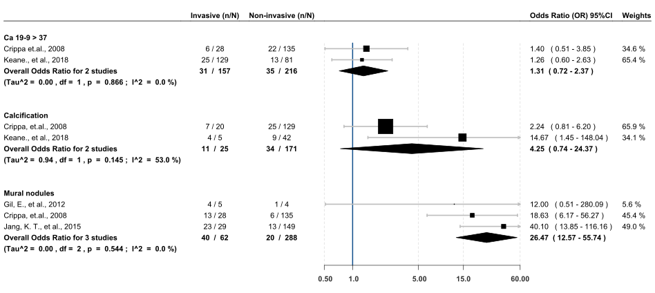

Hyperthyroidism
================
Luis A. Figueroa, Paola Pazmiño, et al.

<i> Analysis and visualization developed by [Luis A.
Figueroa](https://twitter.com/LuisFig1706) </i>

The purpose of this site is to make our meta-analysis as transparent as
possible. All information or documents used, from the protocol to the
final publication, will be available here. If further information is
needed, please do not hesitate to contact us.

<b>Figure A -</b> Dichotomous data analysis: Odds Ratio (OR) 95%CI

  <!-- -->

